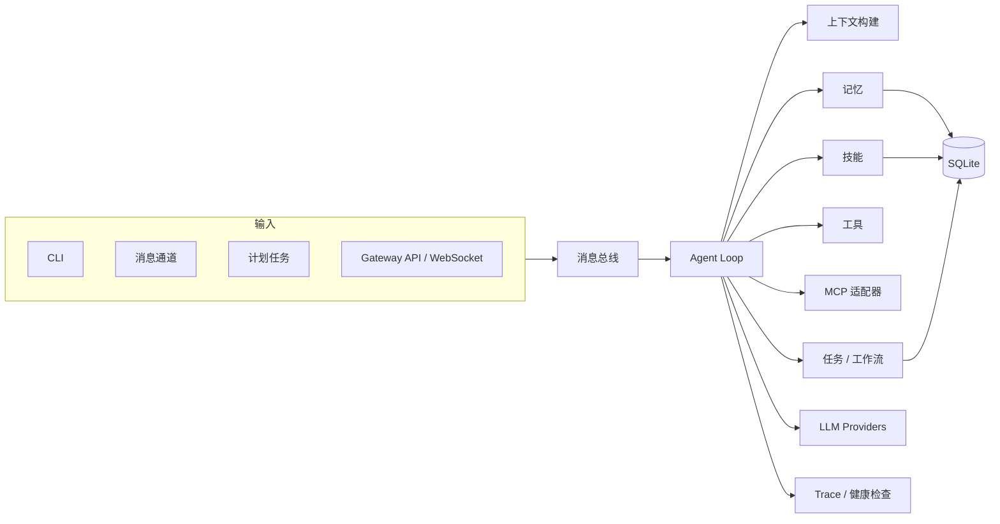

# Echo Agent

<p align="center">
  <strong>可自托管、可长期运行的跨平台 AI Agent。</strong>
</p>

<p align="center">
  <a href="#快速安装">快速安装</a> ·
  <a href="#常用命令">常用命令</a> ·
  <a href="#gateway-api">Gateway</a> ·
  <a href="#架构">架构</a> ·
  <a href="#开发">开发</a>
</p>

<p align="center">
  
  
  <a href="LICENSE"></a>
  
</p>

**Echo Agent** 是一个面向私有部署和持续运行场景的 AI Agent。它可以部署在本地设备、VPS 或现有基础设施中，统一处理 CLI、消息通道、计划任务与 Gateway API，并在同一套会话、记忆、工具、技能、权限和可观测体系下协同工作。适用于个人助理、团队自动化、内部工具入口和跨平台机器人等场景。

使用你信任的模型服务。Echo Agent 支持 OpenAI、Anthropic Claude、Google Gemini、AWS Bedrock、OpenRouter，以及任何 OpenAI 兼容端点。通过配置管理 provider、模型、fallback 策略和凭证池，让同一个 Agent 在不同任务和环境中保持稳定、可控。

<!-- PLACEHOLDER_FEATURES_TABLE -->

<table>
<tr><td><b>持续运行的 Agent 服务</b></td><td>CLI、消息通道、Webhook、计划任务和 Gateway API 共用同一个 Agent Loop。来自不同入口的请求进入统一的会话、记忆、工具和权限上下文。</td></tr>
<tr><td><b>多平台消息接入</b></td><td>Telegram、Discord、Slack、WhatsApp、微信、QQ、飞书、钉钉、企业微信、Matrix、Email 等通道通过统一消息总线接入，支持从本地终端到云端常驻的部署方式。</td></tr>
<tr><td><b>持久化上下文与技能</b></td><td>持久化用户偏好、环境事实、工作记忆和情节回忆；可选向量索引与知识图谱。技能以目录和 <code>SKILL.md</code> 形式沉淀，支持创建、安装和共享。</td></tr>
<tr><td><b>受控工具执行</b></td><td>内置文件、Shell、Web、视觉、TTS、MCP、知识检索、任务和工作流等 30+ 工具，并可从 MCP server 动态注册扩展工具。高风险操作由权限规则、管理员配置和审批流程统一约束。</td></tr>
<tr><td><b>面向系统集成的 Gateway</b></td><td>提供 REST + WebSocket API，内置 Playground、会话管理、健康检查、认证（allowlist / pairing / token）和 A2A 协议入口。</td></tr>
<tr><td><b>多 Agent 路由与并行执行</b></td><td>按任务类型路由到 general、planner、coder、researcher、knowledge、operator 等专用 Agent，支持调度审计、并行执行和长任务编排。</td></tr>
<tr><td><b>自然语言计划任务</b></td><td>内置 cron 调度器，可将日报、巡检、备份、提醒等任务投递到任意通道，适合在 VPS、工作站或现有基础设施上常驻运行。</td></tr>
<tr><td><b>生产部署</b></td><td>开发阶段使用前台 CLI，生产环境注册为 systemd 服务。一条命令完成安装、启用、状态查看和日志排查。</td></tr>
</table>

---

## 快速安装

```bash
curl -fsSL https://raw.githubusercontent.com/fuyuxiang/echo-agent/main/scripts/install.sh | bash
```

支持 Linux、macOS 和 WSL2。安装脚本会完成 Python 3.11、依赖安装和 PATH 配置；Linux 环境可注册 systemd 服务，用于长期运行。

安装完成后：

```bash
source ~/.bashrc          # 或: source ~/.zshrc
echo-agent setup          # 交互式配置向导
echo-agent                # 启动交互式命令行
```

### 源码安装

```bash
git clone https://github.com/fuyuxiang/echo-agent.git
cd echo-agent
curl -LsSf https://astral.sh/uv/install.sh | sh
uv venv venv --python 3.11
source venv/bin/activate
uv pip install -e ".[all]"
echo-agent setup -w .
echo-agent run -w .
```

---

## 常用命令

```bash
echo-agent                # 启动交互式命令行
echo-agent run            # 前台运行 Agent
echo-agent setup          # 完整配置向导
echo-agent setup model    # 配置模型和 provider
echo-agent setup channel  # 配置消息通道
echo-agent status         # 查看当前配置和运行状态
echo-agent gateway        # 启动 Gateway 服务
echo-agent eval -d eval.yaml  # 运行评测数据集
```

### 服务管理（Linux）

```bash
echo-agent service install    # 注册 systemd 服务
echo-agent service start      # 启动服务
echo-agent service stop       # 停止服务
echo-agent service status     # 查看服务状态
echo-agent service logs       # 查看服务日志
echo-agent service restart    # 重启服务
echo-agent service uninstall  # 卸载服务
```

---

## 通道

所有通道都会规范化为统一的消息事件，再进入同一个消息总线和 Agent Loop。来自 CLI、微信、QQBot、Telegram 和 Gateway 的请求共享一致的会话、记忆、工具和权限边界。

| 分类 | 通道 |
|------|------|
| 本地与系统 | `cli`、`webhook`、`cron` |
| 国际平台 | `telegram`、`discord`、`slack`、`whatsapp`、`email`、`matrix` |
| 国内生态 | `wechat`、`weixin`、`qqbot`、`feishu`、`dingtalk`、`wecom` |

---

## Gateway API

Gateway 为 Echo Agent 提供 HTTP / WebSocket 接口，适合接入自定义前端、内部系统、自动化脚本和其他 Agent。根路径 `/` 提供内置 Playground，便于本地调试。

```bash
echo-agent gateway --host 127.0.0.1 --port 9000
```

| 方法 | 路径 | 说明 |
|------|------|------|
| `GET` | `/` | 内置 Playground |
| `GET` | `/api/v1/health` | 健康检查 |
| `POST` | `/api/v1/message` | 发送消息到 Agent |
| `GET` | `/api/v1/sessions` | 查看会话列表 |
| `DELETE` | `/api/v1/sessions/{key}` | 重置 Gateway 会话 |
| `POST` | `/api/v1/pair` | 生成配对码 |
| `POST` | `/api/v1/pair/verify` | 验证配对码 |
| `GET` | `/api/v1/stats` | Gateway 运行统计 |
| `GET` | `/ws` | WebSocket 接口 |
| `GET` | `/.well-known/agent.json` | A2A Agent Card |
| `POST` | `/a2a` | A2A JSON-RPC 入口 |

认证支持 `open`、`allowlist` 和 `pairing` 三种模式，也支持通过 `X-Echo-Agent-Token` 或 `Authorization: Bearer` 传入 API token。公网部署建议启用认证和访问控制。

---

## 配置

Echo Agent 按以下优先级加载配置：`-c` 参数指定的文件 > 工作区中的 `echo-agent.yaml` > `~/.echo-agent/echo-agent.yaml`。

最小可用配置：

```yaml
workspace: "~/.echo-agent"

models:
  defaultModel: "gpt-4o-mini"
  providers:
    - name: "openai"
      apiKey: "<YOUR_API_KEY>"

channels:
  cli:
    enabled: true

permissions:
  adminUsers:
    - "cli_user"
```

支持的 provider 包括 `openai`、`anthropic`、`gemini`/`google`、`bedrock`/`aws`、`openrouter`，以及任何 OpenAI 兼容端点。模型路由支持按任务类型匹配、fallback 策略和凭证池轮换。

环境变量覆盖使用 `ECHO_AGENT_` 前缀，层级之间用双下划线分隔，例如 `ECHO_AGENT_GATEWAY__PORT=9000`。

---

<!-- PLACEHOLDER_REST -->

## 记忆与技能

**记忆**分为用户记忆和环境记忆：用户记忆记录偏好、习惯和个人上下文，环境记忆记录项目事实、工具配置和领域知识。系统支持工作记忆、情节回忆、语义检索、可选向量索引、可选知识图谱、矛盾检测和预测预取。

**技能**采用目录 + `SKILL.md` 的开放格式。内置技能包括 `arxiv`、`weather`、`summarize`、`plan` 和 `skill-creator`。技能支持查看、创建、修改、删除，也可以从本地路径、Git 仓库或 URL 安装。

---

## 工具与权限

30+ 内置工具按类别组织，并由权限与审批系统统一管控；MCP server 可按配置继续动态注册外部工具。

| 分类 | 工具 |
|------|------|
| 工作区 | `read_file`、`write_file`、`edit_file`、`list_dir`、`search_files`、`patch` |
| 执行 | `exec`、`execute_code`、`process` |
| Web | `web_fetch`、`web_search` |
| 协作 | `message`、`notify`、`clarify`、`delegate_task`、`spawn_task` |
| 记忆与会话 | `session_search`、`memory` |
| 任务与工作流 | `todo`、`task`、`workflow`、`cronjob` |
| 技能 | `skills_list`、`skill_view`、`skill_manage`、`skill_install` |
| 多模态 | `vision_analyze`、`text_to_speech`、`image_generate` |
| 知识库 | `knowledge_search`、`knowledge_index` |
| 多 Agent | `agents_list`、`agents_route` |
| MCP | 从配置的 MCP server 动态注册 |

高风险工具（如 `exec`、`write_file`、`edit_file`）默认进入审批流程。可通过 `permissions.adminUsers` 和 `permissions.approval` 调整访问控制与审批策略。

---

## 架构



```text
echo_agent/
├── agent/          # Agent loop、上下文构建、压缩、工具执行
├── bus/            # 消息事件队列
├── channels/       # CLI、消息通道、webhook、cron 适配器
├── cli/            # 配置向导、状态查看、服务管理
├── config/         # 配置 schema、加载器、默认值
├── gateway/        # HTTP / WebSocket Gateway
├── mcp/            # MCP 客户端、传输层、OAuth
├── memory/         # 记忆存储、检索、审查、图谱、向量
├── models/         # Provider、路由、凭证池
├── observability/  # 健康检查、Span、遥测
├── permissions/    # 权限和凭证原语
├── scheduler/      # 计划任务服务
├── session/        # 会话持久化
├── skills/         # 技能存储和审查
├── storage/        # SQLite 后端
└── tasks/          # 任务管理和工作流引擎
```

---

## 开发

```bash
git clone https://github.com/fuyuxiang/echo-agent.git
cd echo-agent
uv venv venv --python 3.11
source venv/bin/activate
uv pip install -e ".[all,dev]"

ruff check .
pytest
echo-agent run -w .
```

---

## 安全建议

- 请将 API key、token 和 `data/credentials.json` 存放在本地环境或专用密钥管理系统中。
- 本地开发优先绑定 `127.0.0.1`。
- Gateway 绑定 `0.0.0.0` 前应启用认证和访问控制。
- Shell、进程和代码执行属于高权限能力，建议仅向可信用户开放。
- 排查问题时优先查看 `echo-agent status`；生产环境可继续查看 `echo-agent service logs`。

---

## License

MIT
