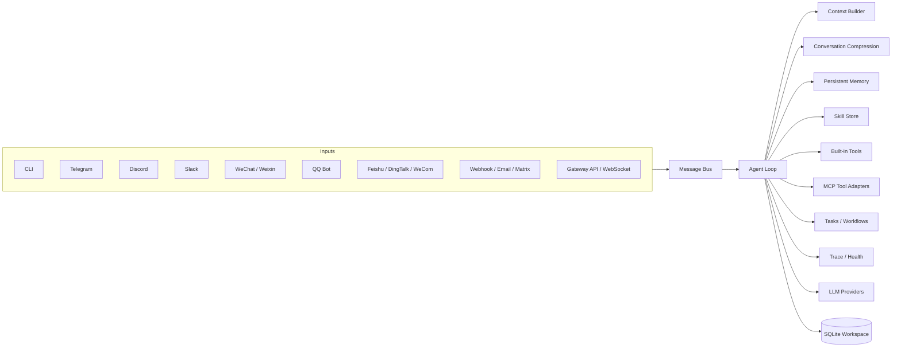

# Echo Agent

<p align="center">
  <strong>一个面向自托管场景的 AI Agent runtime。</strong><br />
  多通道接入、工具调用、长期记忆、技能沉淀、Gateway API，一套核心运行时统一起来。
</p>

<p align="center">
  <a href="#快速开始">快速开始</a> ·
  <a href="#核心能力">核心能力</a> ·
  <a href="#gateway-api">Gateway API</a> ·
  <a href="#配置说明">配置说明</a> ·
  <a href="#开发">开发</a>
</p>

<p align="center">
  
  
  
</p>

Echo Agent 是一个模块化的 AI Agent 框架。它不是“只会聊天”的 Bot，而是一个可以长期运行的执行层：接收来自 CLI、聊天平台和 HTTP Gateway 的消息，构建带记忆的上下文，调用工具完成任务，并把状态、日志、任务、工作流等信息持久化到工作区中。

当前代码已经具备的核心部分包括：

- 15 个通道适配器，统一进入同一个消息总线和 Agent Loop
- 两打以上内置工具，外加可扩展的 MCP 工具接入
- 双层持久记忆、上下文压缩、记忆检索与后台记忆提炼
- 基于 `SKILL.md` 的技能系统，支持内置技能和外部技能安装
- SQLite-backed 的会话、记忆、任务、工作流、日志与向量元数据存储
- 自带 Web playground 的 Gateway API

## Why Echo Agent

- **Self-hosted first**: 配置、日志、记忆、技能和状态数据都可以留在你的工作区里。
- **One runtime, many surfaces**: 一套核心运行时可以同时服务 CLI、聊天平台和 API。
- **Tool-capable by design**: 文件、Shell、搜索、视觉、消息、记忆、技能、任务和 MCP 都是一级能力。
- **Built for long-running assistants**: 有会话持久化、记忆快照、上下文压缩、trace 日志和健康检查。
- **Extensible without rewriting the core**: 新通道、新技能、新 provider、新 MCP server 都能增量接入。

## 架构



## 核心能力

| 能力 | 当前代码提供什么 |
| --- | --- |
| 多通道接入 | 15 个适配器通过统一事件模型接到同一个运行时。 |
| 工具调用 | 工作区、Web、多模态、协作、技能、记忆类工具统一注册到 `ToolRegistry`。 |
| 长期记忆 | 用户记忆与环境记忆分层持久化，支持搜索、替换、快照注入和后台 review。 |
| 上下文控制 | 会话历史持久化、窗口裁剪、摘要压缩、工具结果裁剪和检索增强上下文。 |
| 技能系统 | 使用 `SKILL.md` + frontmatter 组织技能，支持查看、创建、patch、删除和安装外部技能。 |
| Gateway | REST、WebSocket、认证、限流、会话策略、媒体缓存、hooks、内置 playground。 |
| 状态存储 | SQLite 持久化会话、记忆、任务、工作流、日志和向量元数据。 |
| 可观测性 | Trace 日志、健康检查、网关健康接口和运行状态汇总。 |

## 支持的通道

Echo Agent 当前注册了 15 个通道适配器：

- **本地与系统接入**: `cli`, `webhook`, `cron`
- **国际通用平台**: `telegram`, `discord`, `slack`, `whatsapp`, `email`, `matrix`
- **微信与企业协同生态**: `wechat`, `weixin`, `qqbot`, `feishu`, `dingtalk`, `wecom`

其中：

- `cli` 默认启用，适合本地开发与调试。
- `gateway` 不是消息通道，而是独立的 HTTP / WebSocket 服务层。
- 配置 `channels.transcriptionApiKey` 后，部分通道可以把音频消息交给 Groq Whisper 转写。

## 工具体系

Echo Agent 的工具能力不是零散脚本，而是统一纳入 `ToolRegistry` 的可调用能力。按当前代码，可以大致分成以下几类。

### 工作区与执行

- `exec`
- `read_file`
- `write_file`
- `edit_file`
- `list_dir`
- `search_files`
- `patch`
- `execute_code`
- `process`

### Web 与多模态

- `web_fetch`
- `web_search`
  需要配置 `tools.web.searchApiKey`
- `vision_analyze`
- `image_generate`
  需要配置 `tools.imageGen.apiKey`
- `text_to_speech`

### 协作与消息

- `message`
- `notify`
- `clarify`
- `delegate_task`
- `spawn_task`

### 记忆、会话与技能

- `memory`
- `session_search`
- `skills_list`
- `skill_view`
- `skill_manage`
- `skill_install`

### 计划与跟踪

- `todo`
- `task`
- `workflow`

> 重要
>
> Echo Agent 当前的工具权限是**保守默认值**。如果不配置 `permissions.adminUsers` 或显式权限规则，工具调用会被拒绝。
>
> 本地 CLI 场景下，通常需要把 `cli_user` 加进 `permissions.adminUsers`。

## 记忆、上下文与技能

### 持久记忆

记忆系统分为两层：

- **User memory**: 用户偏好、表达习惯、长期要求
- **Environment memory**: 项目事实、约定、工具配置、领域知识

当前实现支持：

- `add / replace / remove / search / list`
- 关键字与分数检索
- 重要度与访问衰减
- 记忆快照注入 system prompt
- 后台 `MemoryReviewer` 自动提炼有价值信息
- 对提示注入、隐形字符和敏感 exfiltration 片段的持久化拦截
- 原子写入与文件锁，降低并发覆盖风险

### 上下文管理

每次推理前，运行时会分层构造上下文：

1. Agent 身份与运行时元数据
2. 工作区中的 `AGENTS.md` / `SOUL.md` / `USER.md` / `TOOLS.md`
3. 记忆快照
4. 技能摘要
5. 会话历史
6. 检索到的相关记忆

当历史过长时，`ConversationCompressor` 会执行上下文压缩，减少 token 占用并保留当前轮更相关的信息。

### 技能系统

技能系统使用磁盘目录和 `SKILL.md` 作为标准格式，支持三类操作：

- 发现与读取技能
- 创建、编辑、patch、删除技能
- 从 `git` / 本地目录 / URL 安装外部技能

仓库当前内置了 5 个技能：

- `arxiv`
- `weather`
- `summarize`
- `plan`
- `skill-creator`

在工具调用较多的非平凡对话之后，后台 `SkillReviewer` 还可以把“可复用的方法论”沉淀成技能。

## Provider 与模型路由

当前代码支持以下 Provider：

| Provider | 说明 |
| --- | --- |
| OpenAI | 标准 OpenAI 接口 |
| Anthropic | Claude 系列模型 |
| Gemini | Google Gemini |
| Bedrock | 通过 AWS Bedrock 调用模型 |
| OpenRouter | 通过 OpenRouter 路由模型 |
| OpenAI-compatible | 未识别 provider name 时回落到 OpenAI-compatible 模式 |

Provider 层当前还带有：

- 默认模型与路由配置
- 凭证池轮换
- RPM 限速
- 错误重试与恢复
- OpenRouter 扩展 header 与 provider preference

## 快速开始

### 1. 一键安装

```bash
curl -fsSL https://raw.githubusercontent.com/fuyuxiang/echo-agent/main/scripts/install.sh | bash
```

适用于 Linux、macOS 和 WSL2。安装脚本会自动：

- 安装 `uv` 与 Python 3.11（如缺失）
- 将仓库克隆到 `~/.echo-agent/echo-agent`
- 创建虚拟环境并安装 `echo-agent`
- 把命令链接到 `~/.local/bin/echo-agent`
- 默认把配置和数据放到 `~/.echo-agent/`

安装完成后，重新加载 shell：

```bash
source ~/.bashrc    # 或 ~/.zshrc
echo-agent setup
echo-agent
```

如果你只想手动安装或参与开发，可以使用源码安装：

```bash
git clone https://github.com/fuyuxiang/echo-agent.git
cd echo-agent
curl -LsSf https://astral.sh/uv/install.sh | sh
uv venv venv --python 3.11
source venv/bin/activate
uv pip install -e ".[all]"
```

### 2. 初始化配置

全局安装默认读取 `~/.echo-agent/echo-agent.yaml`。第一次在交互式终端里运行 `echo-agent` 时，如果当前目录和 `~/.echo-agent/` 都没有配置文件，程序会提示是否启动 setup wizard。你也可以显式执行：

```bash
echo-agent setup
```

如果你想把配置和工作区放到当前项目目录，而不是 `~/.echo-agent/`：

```bash
echo-agent setup -w .
```

常用命令：

```bash
echo-agent status
echo-agent run
echo-agent gateway --port 9000
```

如果没有配置任何 provider，Echo Agent 会使用 stub provider 启动，并返回配置引导信息，而不是执行真实模型调用。

### 3. 准备一份最小可用配置

默认全局配置文件位置：

```text
~/.echo-agent/echo-agent.yaml
```

最小可用示例：

```yaml
workspace: "~/.echo-agent"

models:
  defaultModel: "gpt-4o-mini"
  providers:
    - name: "openai"
      apiKey: "<YOUR_OPENAI_API_KEY>"

channels:
  cli:
    enabled: true

permissions:
  adminUsers:
    - "cli_user"
```

这份配置的含义是：

- 使用 `~/.echo-agent` 作为默认工作区
- 启用 CLI 通道
- 让本地 CLI 用户 `cli_user` 具备工具使用权限
- 使用 OpenAI 作为默认模型提供方

如果你是按项目使用 Echo Agent，可以把 `workspace` 改成 `"."`，并将配置保存到项目目录下的 `echo-agent.yaml`。

如果你还需要 Web 搜索，可以继续加：

```yaml
tools:
  web:
    searchApiKey: "<YOUR_SEARCH_API_KEY>"
```

### 4. 启动

```bash
echo-agent
```

或者显式指定：

```bash
echo-agent run -c ~/.echo-agent/echo-agent.yaml
echo-agent run -c echo-agent.yaml -w .
```

启动后你会直接进入 CLI 对话。输入 `exit`、`quit` 或 `/quit` 可以退出。

## Gateway API

Echo Agent 自带一个独立的 HTTP / WebSocket Gateway。启用后，根路径 `/` 会提供内置 playground 页面，API 默认前缀是 `/api/v1`。

### 网关配置示例

```yaml
gateway:
  enabled: true
  host: "0.0.0.0"
  port: 9000
  auth:
    mode: "open"
```

启动命令：

```bash
echo-agent gateway -c echo-agent.yaml --port 9000
```

### 主要接口

| Method | Path | 说明 |
| --- | --- | --- |
| `GET` | `/` | 内置 playground 页面 |
| `POST` | `/api/v1/message` | 发送消息到 Agent |
| `GET` | `/api/v1/health` | 网关健康状态 |
| `GET` | `/api/v1/sessions` | 查看会话列表 |
| `DELETE` | `/api/v1/sessions/{key}` | 重置指定会话 |
| `POST` | `/api/v1/pair` | 生成配对码 |
| `POST` | `/api/v1/pair/verify` | 校验配对码 |
| `GET` | `/api/v1/stats` | 查看统计信息 |
| `GET` | `/ws` | WebSocket 接口 |

### 请求示例

```bash
curl -X POST "http://127.0.0.1:9000/api/v1/message" \
  -H "Content-Type: application/json" \
  -d '{
    "platform": "api",
    "user_id": "demo",
    "chat_id": "demo",
    "text": "请总结当前工作区的目录结构",
    "wait": true,
    "timeout_seconds": 120
  }'
```

Gateway 还内置了：

- `open` / `allowlist` / `pairing` 三种认证模式
- 平台级速率限制
- session reset policy
- progressive edit
- media cache
- hooks 目录加载
- delivery routing

## 配置说明

### 配置文件发现顺序

运行时会在当前目录按以下顺序查找配置文件：

1. `echo-agent.yaml`
2. `echo-agent.yml`
3. `config.yaml`
4. `config.yml`

### 环境变量覆盖

所有配置项都可以通过 `ECHO_AGENT_` 前缀环境变量覆盖，层级之间使用双下划线：

```bash
export ECHO_AGENT_MODELS__DEFAULTMODEL=gpt-4o-mini
export ECHO_AGENT_GATEWAY__ENABLED=true
export ECHO_AGENT_OBSERVABILITY__LOGLEVEL=DEBUG
```

### 工作区数据

`workspace` 是 Echo Agent 的状态根目录。默认运行时会在其中写入：

- `data/echo_agent.db`
- `data/memory/`
- `data/logs/`
- `data/media_cache/`
- `data/credentials.json`

如果你希望把状态与代码仓库分离，最简单的做法是把 `workspace` 指到单独目录，例如 `~/.echo-agent`。

### 权限建议

如果你的目标是“本地 CLI 可以放心地调用工具”，最简单的方式是：

- 把 `cli_user` 配到 `permissions.adminUsers`

如果你的目标是“不同平台、不同用户、不同工具分级授权”，再逐步引入更细的权限规则。

## MCP 集成

Echo Agent 可以把 MCP server 暴露的工具注册进自己的 tool registry。当前实现支持：

- `stdio` 启动本地 MCP server
- `http` 连接远程 MCP server
- `toolsInclude` / `toolsExclude` 过滤
- OAuth token 存储
- 重连与工具刷新

一个最小配置示例：

```yaml
tools:
  mcpServers:
    docs:
      url: "http://127.0.0.1:8081/mcp"
      enabled: true
```

## 项目结构

```text
echo_agent/
├── agent/          # Agent loop, context builder, compression, tools, executors
├── bus/            # 统一消息事件总线
├── channels/       # 15 个消息通道适配器
├── cli/            # setup/status/terminal UX
├── config/         # schema, loader, default config
├── gateway/        # HTTP / WebSocket gateway
├── mcp/            # MCP client, adapter, oauth, transport
├── memory/         # memory store, consolidator, reviewer
├── models/         # provider, router, inference, credential pool
├── observability/  # trace logger and health checker
├── permissions/    # permission, approval, credential primitives
├── scheduler/      # scheduler service
├── session/        # session persistence and lifecycle
├── skills/         # skill store and reviewer
├── storage/        # SQLite backend
└── tasks/          # task manager and workflow engine
```

## 适用场景

Echo Agent 比较适合下面这类项目：

- 想把一个 Agent 同时接入多个消息平台，而不是为每个平台重复写业务逻辑
- 需要 Agent 记住长期偏好、项目约定和环境知识
- 需要可落地的工具调用，而不是只做问答
- 需要 HTTP / WebSocket 接口把 Agent 变成一个后端服务
- 需要技能沉淀和 MCP 扩展，让能力随着项目演进不断积累

## 开发

安装开发依赖：

```bash
pip install -e ".[dev]"
```

本仓库当前最直接的本地校验方式是：

```bash
ruff check .
```

如果你修改了 README、配置或通道接入逻辑，建议至少做一次本地烟测：

```bash
echo-agent status
echo-agent run -c echo-agent.yaml
```

## License

MIT
